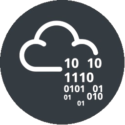

<h3 align="center">
  Welcome to Subho's profile!
  
</h3>

<!-- Typing SVG  - https://readme-typing-svg.herokuapp.com/demo/ 
leetcode: https://leetcard.jacoblin.cool/ -->
<h2 align="center">
  
  </h2>
 
 <!-- platfrom -->

<!-- social -->
 

   
  &#8287;&#8287;&#8287;&#8287;&#8287;
  
  &#8287;&#8287;&#8287;&#8287;&#8287;
  
  &#8287;&#8287;&#8287;&#8287;&#8287;
  
  &#8287;&#8287;&#8287;&#8287;&#8287;
  
  &#8287;&#8287;&#8287;&#8287;&#8287;
  

  
  

  
  </a>
  </a>
  </a>
  
  
👋 Hello! I'm Subhodeep Baroi, a passionate cybersecurity professional with a strong foundation in software development. I am dedicated to enhancing cybersecurity practices and promoting awareness in the digital world.

I’m a research scientist working to better understand About AI and Cybersecurity. My expertise includes Linux System Administration, Web development. I enjoy generating new ideas and devising feasible solutions to broadly relevant problems. Currently, I’m seeking opportunities that will allow me to develop and promote technologies that benefit Companies. Specific fields of interest include BlockChain, Networking, Linux OS Development, Digital forensics, System analysis, and Automotion.

I am also a bug bounty hunter. The most essential feature of me is that I am a reliable worker dedicating myself fully to my projects. Just handover your tasks to me and take a rest

  
  
  
  
- 🔭 I’m currently working on [Appsec](https://#/)

- 👨‍💻 )🌱 Continuous Learner

- 💬 Ask me about **Linux, Python, CMD, Pentester, Appsec**

- 📄 Know about my [Experiences](https://#.github.io/#resume)
  
- 👨‍💻 [Hire Me](http://#.com/)

- ⚡ Fun fact **I Think I love my computer, more then myself.**

 

<h2 align="left" id="naemazam">Certificates</h2>

>Professional Certificates

<table>
  <tr>
    <td align="center" width="96">
      
       THM Jr Pentester
    </td>
    <td align="center" width="96">
      
       THM Offensive Security 
    </td>
    <td align="center" width="96">
      
       Ec-council (EHE)
    </td>
    <td align="center" width="96">
      
       ApiSec University
    </td>
     </tr>
</table>

<h2 align="left" id="naemazam">Dev-Tools</h2>

> Progamming languages

<table>
  <tr>
    <td align="center" width="96">
      
       Bash
    </td>
    <td align="center" width="96">
      
       Python
    </td>
    <td align="center" width="96">
      
       C
    </td>
    <td align="center" width="96">
      
       C++
    </td>
    <td align="center" width="96">
      
       JavaScript
    </td>
     <td align="center" width="96">
      
       HTML
    </td>
     <td align="center" width="96">
      
       SQL
    </td>
  </tr>
  <tr>
    <td align="center" width="96">
      
       Powershell
    </td>
    <td align="center" width="96">
      
       PHP
    </td>
    <td align="center" width="96">
      
       Graph-Ql
    </td>
    <td align="center" width="96">
      
       Rust
    </td>
    <td align="center" width="96">
      
       Assembly x86
    </td>
  </tr>
</table>

> Frameworks and libraries

<table>
  <tr>
    <td align="center" width="96">
      
       Django
    </td>
    <td align="center" width="96">
      
       bootstrap
    </td>
    <td align="center" width="96">
      
       flutter
    </td>
    <td align="center" width="96">
      
       React
    </td>
     <td align="center" width="96">
      
       Wordpress
    </td>
     <td align="center" width="96">
      
       Flask
    </td>
    <td align="center" width="96">
      
       Node JS
    </td>
    </tr>
</table>

> Databases and cloud hosting

<table>
  <tr>
    <td align="center" width="96">
      
       GitHub Page
    </td>
    <td align="center" width="96">
      
       my-sql
    </td>
    <td align="center" width="96">
      
       Aws
    </td>
    <td align="center" width="96">
      
       Mongo Db
    </td>
    <td align="center" width="96">
      
       Postgres Db
    </td>
    <td align="center" width="96">
      
       Docker
    </td>
    </tr>
</table>

> operating system

<table>
  <tr>
    <td align="center" width="96">
      
       Windows
    </td>
    <td align="center" width="96">
      
       Ret-Hat
    </td>
      <td td align="center" width="96">
        
         ubuntu Linux
    </td>
    <td align="center" width="96">
      
       Debian
    </td>
    <td align="center" width="96">
      
       Raspberry pi
    </td>
    <td align="center" width="96">
      
       kali
    </td>
    <td align="center" width="96">
      
       ARCH
    </td>
    <td align="center" width="96">
      
       android
    </td>
    <td align="center" width="96">
      
       Chrome os
    </td>
  </tr>
</table>

> Software and tools
<table>
  <tr>
    <td align="center" width="96">
      
       nmap
    </td>
    <td align="center" width="96">
      
       Anaconda
    </td>
    <td align="center" width="96">
      
       Git
    </td>
     <td align="center" width="96">
      
       Nuclie
    </td>
   <td align="center" width="96">
      
       Burp Suite Pro
    </td>
    <td align="center" width="96">
      
       wiershark
    </td>
    <td align="center" width="96">
      
       Visual Studio
    </td>
     <tr>
    <td align="center" width="96">
      
       Jupyter Notebook
    </td>
    <td align="center" width="96">
      
       Sublime
    </td>
    <td align="center" width="96">
      
       Metasploit
    </td>
    <td align="center" width="96">
      
       BeeF
    </td>
    <td align="center" width="96">
      
       Fuff
    </td>
    <td align="center" width="96">
      
       WfuZZ
    </td>
    <td align="center" width="96">
      
       Android Studio
    </td>
    </tr>
</table>

<!-- table emd-->

<!-- project table -->
 

## 📘 My top  projects

 
 
 
 
 
 

  

  <h2> My Projects Box </h2>
  
  

  

  

  
  
  

  <h1 align="center">Summary Of My Github Status</h1>

  
 

 

  

<table align="center" border="1">
<tr align="center">
<td colspan="3"></td>
</tr>
<tr align="center">
<td></td>
<td></td>
<td colspan="3"></td>
</tr>
<tr align="center">
<td colspan="3"></td>
</tr>
<tr align="center">
<td colspan="3"></td>
</tr>
</table>
  
